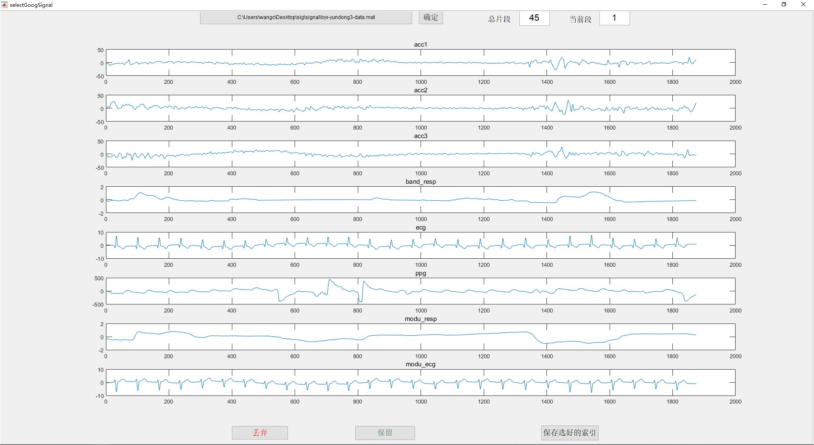

# GUI-for-signal-selection
I need to select signals segments with high quality, so I wrote this GUI by Matlab to check my data by segments. following is a screenshot when my GUI is running, you can store the indexes of the signal segments that you think satisfying.

